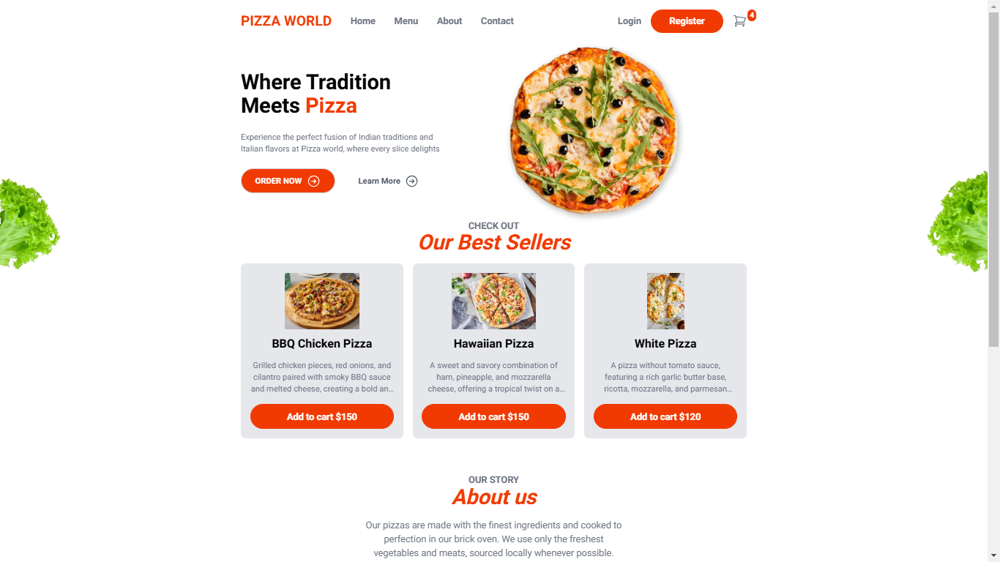

    

# 🍕 Pizza world 

Pizza world is a full-stack web application built using Next.js 14, Node.js, and MongoDB with Tailwind CSS. It offers a complete online pizza ordering experience, including user authentication, shopping cart functionality, and an admin dashboard for managing products, categories, users, and orders.





## ✨ Features

### General

- **Home Page:** Includes a Hero section, Menu, About, and Contact sections.
- **Navigation:** Easily navigate through different sections and pages.

### User Functionality

- **🍽️Menu:** Browse a variety of pizzas available for order.
- **🛒Shopping Cart:** Add pizzas to the cart, choose pizza sizes, add extra toppings, and view the cart with subtotal, delivery charges, and total charges.
- **💳Checkout:** Fill in delivery details and proceed to payment, I haven't added a payment gateway, you can use stripe, shopify or razorpay.

### 🔐 Authentication

- **User Login:** Login with Google or create an account.
- **Profile Management:** Update profile information, including uploading a profile image to Firebase.

### 🔧 Admin Functionality

- **Admin Dashboard:** Accessible only to admins.
  - **Categories:** Perform CRUD operations on categories (add, edit, delete, and search).
  - **Menu Items:** Perform CRUD operations on menu items.
  - **Users:** View all users and manage user roles (e.g., promote users to admin).
  - **Carts:** View and manage all carts.

## 🛠️ Technologies Used

### Frontend

- **[Next.js 14](https://nextjs.org/):** The main framework for building the application.
- **[Tailwind CSS](https://tailwindcss.com/):** For styling the application.
- **[React-Hot-Toast](https://react-hot-toast.com/):** For notifications and toasts.

### Backend

- **Node.js:** The runtime environment.
- **MongoDB:** The database for storing application data.
- **Mongoose:** An ODM for MongoDB.

### Other Libraries

- **[Next-Auth](https://next-auth.js.org/getting-started/example):** For authentication and session management.
- **[Next Adapters](https://next-auth.js.org/adapters):** For adapting various Next.js features.
- **[Uniqid](https://classic.yarnpkg.com/en/package/uniqid):** For generating unique IDs.
- **[Firebase](https://firebase.google.com/):** For handling image uploads to Firebase storage.

## 🚀 Getting Started

### Prerequisites

- Node.js
- MongoDB
- Firebase Account (for image uploads)
- Shopify or Stripe or RazorPay Account (for payment processing)

### Installation

1. **Clone the repository:**

   ```sh
   https://github.com/gowtham6477/Pizza-World.git
   cd pizza-world
   ```

2. **Install dependencies:**

   ```sh
   yarn install
   ```

3. **Set up environment variables:**
   Create a `.env` file in the root of the project or use the `.env.example` for refrence and add the following environment variables:

   ```env
   MONGO_URL=<Your MongoDB connection string>
   NEXTAUTH_URL=<Your NextAuth URL>
   NEXTAUTH_SECRET=<Your NextAuth secret>
   GOOGLE_CLIENT_ID=<Your Google client id>
   GOOGLE_CLIENT_SECRET=<Your Google client secret key>
   FIREBASE=<Refer .env.example>

   ```

4. **Run the development server:**

   ```sh
   npm run dev
   ```

5. **Open the application in your browser:**
   ```sh
   http://localhost:3000
   ```

## 💡 Usage

### User Experience

1. **Browse Menu:** Navigate to the menu to see different pizzas.
2. **Add to Cart:** Customize your pizza with size and toppings and add it to the cart.
3. **Checkout:** Proceed to checkout, fill in your details, and pay via your payment gateway.
4. **View Order:** After payment, view your order details on the order page.

### Admin Experience

1. **Login as Admin:** Access the admin dashboard.
2. **Manage Categories:** Add, edit, delete, or search categories.
3. **Manage Menu Items:** Perform CRUD operations on menu items.
4. **Manage Users:** View and manage user roles.
5. **Manage Orders:** View and manage all orders.

## 🤝 Contributing

1. Fork the repository.
2. Create a new branch (`git checkout -b feature/feature-name`).
3. Make your changes.
4. Commit your changes (`git commit -m 'Add new feature'`).
5. Push to the branch (`git push origin feature/feature-name`).
6. Open a pull request.

---

Feel free to contribute, open issues, and submit pull requests to make Pizza world even better! Enjoy your pizza ordering experience!
